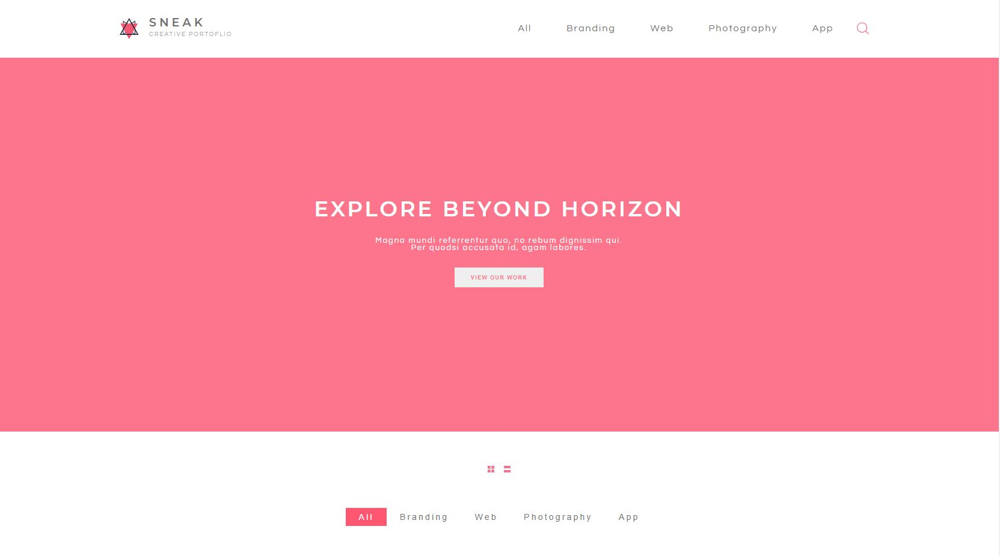

# HTML CSS and JavaScript Coding Challenge

> In this challenge, I had created the markdown styling and some dynamic JavaScript to build the home page using the provided design as a guide
> I implemented the JavaScript module bundler webpack to organize and work in a modular way using JavaScript and the preprocessor SASS.

## Built With

- Webpack
- VS Code
- JavaScript
- SASS.

## Demo Screenshots

## Live Demo

[Live version](https://affectionate-curie-c4d0b7.netlify.app/)

## Prerequisites

node: v12.19.0
## Getting Started
To get a local copy up and running follow these simple example steps.

- Open a terminal or command prompt interface on your PC.
- Clone the repo with: `git clone https://github.com/kenderb/home_design_SPA.git`
- On the terminal navigate to the project directory using `cd home_design_SPA/`

## 📝 Setup

1. On the terminal navigate to the project directory using `cd home_design_SPA/`.
2. Install dependencies using: `npm install`.
3. Use the `.env_sample` file in the root directory to put your Unsplash API key in the value `API_KEY=YOUR_API_KEY_HERE` after that save the file as `.env`.
4. Run a server using: `npx webpack serve`.
5. Open `http://localhost:3000/` in your browser or open the index.html on your browser.

## Authors

👤 **Kender Bolivar**

- GitHub: [@kenderb](https://github.com/ken)
- Twitter: [@KBTarts](https://twitter.com/KBTarts )
- LinkedIn: [KenderBolivar](https://www.linkedin.com/in/kender-bolivar-1736086b/ )
